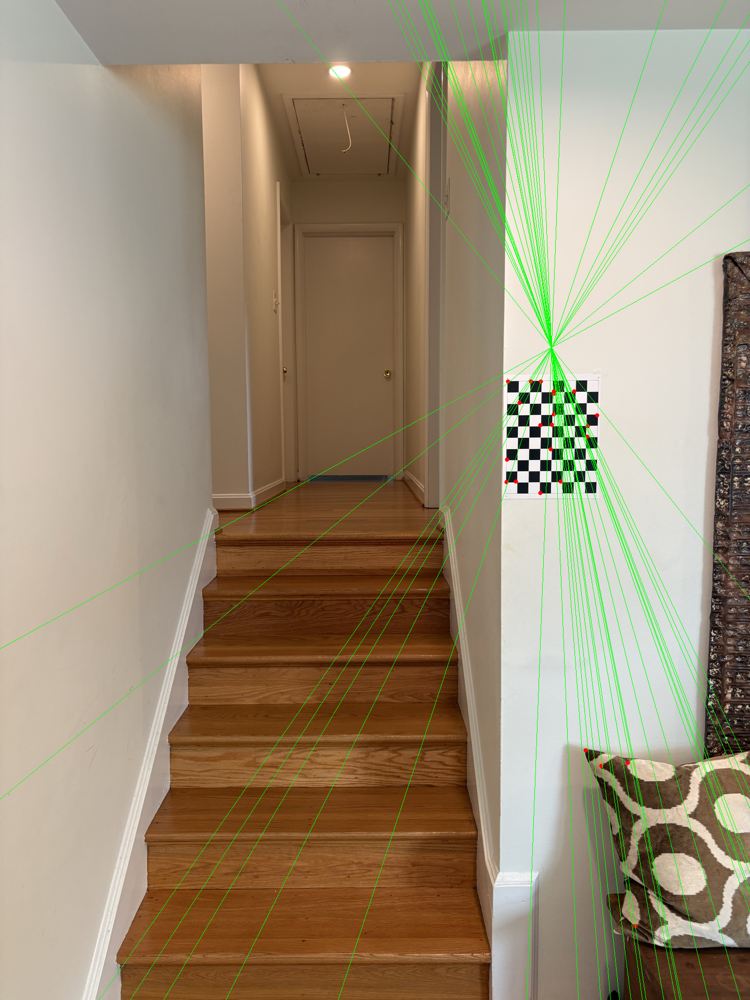
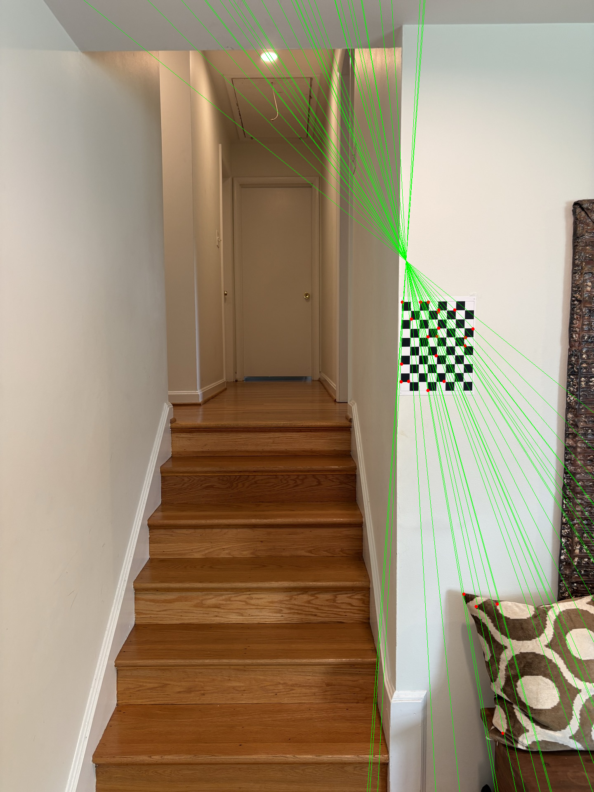
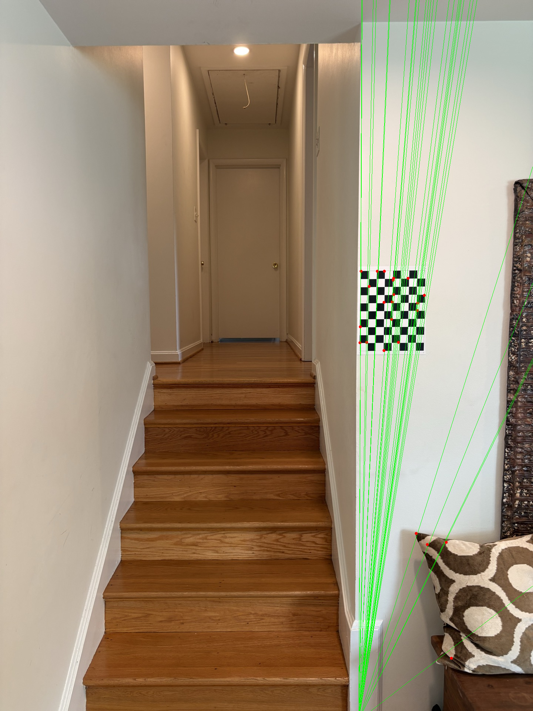
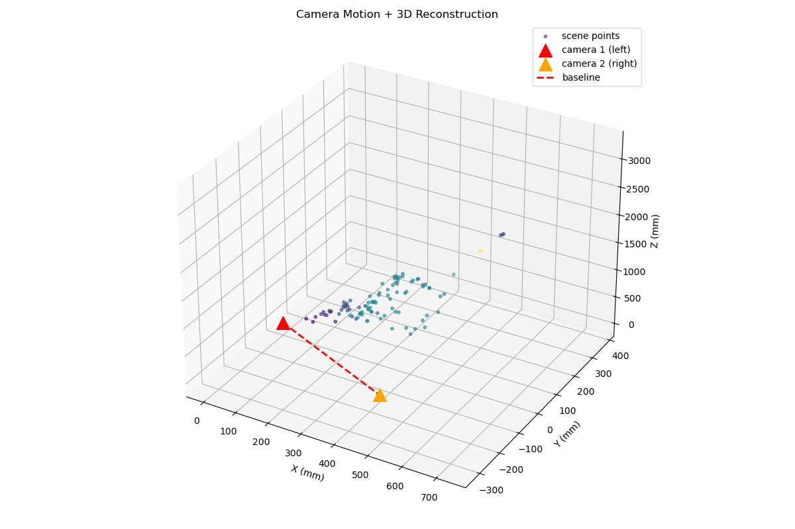

# Fundamental Matrix from Scratch

A hand-rolled implementation of the **normalized 8-point algorithm** for estimating
the fundamental matrix between two images, written in C++ with OpenCV. Built to learn
classical computer vision and C++ from the ground up — the linear algebra (building the
constraint matrix, the two SVDs, rank-2 enforcement) is implemented by hand rather than
calling `cv::findFundamentalMat`. Extends to the essential matrix and camera pose recovery.

## What it does

Given two photos of the same scene from different viewpoints, it:

1. Detects and matches features (ORB + brute-force Hamming matching)
2. Computes the fundamental matrix `F` via the normalized 8-point algorithm
3. Verifies the result against OpenCV and by epipolar constraint error
4. Filters RANSAC inliers using **Sampson distance** — a first-order geometric
   error that weights each correspondence by how far its matched point lies from
   the predicted epipolar line, without requiring full triangulation:
   `d_S = (x'ᵀFx)² / ((Fx)₀² + (Fx)₁² + (Fᵀx')₀² + (Fᵀx')₁²)`
5. Draws the epipolar lines to confirm the geometry visually
6. Lifts `F` to the **essential matrix** `E = KᵀFK` using calibrated intrinsics
7. Recovers camera **rotation R** and **translation t** via `cv::recoverPose`, resolving
   the 4-way sign ambiguity with a cheirality check

`F` encodes the epipolar geometry between the two views: for corresponding points
`x` and `x'`, it satisfies `x'ᵀ F x = 0`. `E` is the calibrated version — same
constraint but in normalized camera coordinates rather than pixels.

## Build

Requires OpenCV and CMake.

```bash
mkdir build && cd build
cmake ..
make
cd ..
```

## Run

Run from the project root so the `data/` image paths resolve:

```bash
./build/00_load        # load + display the image pair
./build/01_match       # detect + match features, draw matches
./build/02_opencv_f    # reference F via cv::findFundamentalMat + epipolar lines
./build/03_my_f        # hand-rolled 8-point F with RANSAC + Sampson distance
./build/04_calibrate   # calibrate camera intrinsics from checkerboard images
./build/05_essential   # essential matrix + recover R and t between cameras
./build/06_triangulate # metric 3D reconstruction from stereo pair
./build/07_rectify     # stereo rectification, saves rectified images and Q matrix
```

## Project layout

```
apps/          one small program per build step (00–05)
  00_load        load + display image pair
  01_match       detect + match features
  02_opencv_f    reference F via cv::findFundamentalMat
  03_my_f        hand-rolled 8-point F with RANSAC
  04_calibrate   camera calibration from a checkerboard image set
  05_essential   essential matrix + recover R and t between cameras
  06_triangulate metric 3D reconstruction from stereo pair
  07_rectify     stereo rectification — warps both images so epipolar lines are horizontal rows, saves rectified images and Q matrix for SGBM
include/
  epipolar_viz.hpp   helpers for drawing epipolar lines
  fundemental.hpp    hand-rolled 8-point algorithm, RANSAC, Sampson error
  matching.hpp       ORB feature detection and brute-force matching
data/
  left.jpg / right.jpg         staircase stereo pair
  calibration_imgs/            checkerboard images used for intrinsic calibration
output/
  camera_calibation.yml        camera intrinsics + distortion coefficients
  fundamental.yml              RANSAC fundamental matrix F
  essential.yml                essential matrix E, rotation R, translation t
CMakeLists.txt
```

## The algorithm (8-point, in order)

1. **Normalize** points (center at origin, scale mean distance to √2) — critical for
   numerical stability
2. **Build** the n×9 constraint matrix `A`, one row per correspondence
3. **SVD #1** — solve `Af = 0`; the solution is the singular vector with the smallest
   singular value, reshaped to 3×3
4. **SVD #2** — zero the smallest singular value to enforce rank 2 (makes all epipolar
   lines meet at a single epipole)
5. **Denormalize** — undo the normalization so `F` works in pixel coordinates

## Results

### Staircase scene (left.jpg / right.jpg)

Scene: a staircase with a hallway receding to a far door, a checkerboard on the right wall as a metric reference, and a carved mirror frame and pillow in the foreground — good depth variation from near to far.

**Matching:** ORB with 2000 features (bumped from 500 to prevent the checkerboard from dominating matches). Matches filtered with Lowe's ratio test (threshold 0.75, `knnMatch` k=2) in `computeOrbMatches`, yielding **329 good matches**. All three estimators below use the same filtered point set for a fair comparison.

**Hand-rolled 8-point algorithm (all matches, no RANSAC)**

Epipole lands inside the frame; lines are skewed — outliers pull the algebraic fit off the true geometry.

**Hand-rolled 8-point algorithm with RANSAC + Sampson distance (3000 iterations) — 101 inliers**

Epipole off the right edge; lines are nearly parallel — matches the OpenCV reference visually.

**OpenCV reference (`cv::findFundamentalMat` with `FM_RANSAC`) — 135 inliers**

Epipole off the right edge; lines are nearly parallel — consistent with a predominantly sideways camera translation.

**Camera motion and 3D point cloud**

Camera positions (red = left, orange = right) and baseline plotted against the reconstructed 3D point cloud. The Y-dominant baseline reflects the vertical translation between the two shots, confirmed by the rectification check.

# Camera Motion and Written Results

The scene is a staircase with strong depth variation (checkerboard metric reference, foreground objects, receding hallway). The camera was translated roughly sideways, so epipolar lines should fan out from a distant epipole near or beyond the right edge of the frame.

The raw algebraic 8-point fit (`my_f`) satisfies the epipolar constraint numerically but is pulled off by outliers, placing the epipole inside the frame. Switching to Sampson-distance RANSAC (`ransac_f`, 10 000 iterations, 101 inliers) recovers geometrically correct geometry that matches the OpenCV reference: epipole off-frame to the right, lines nearly parallel across the scene, consistent with the actual sideways camera translation.


## Camera Calibration Results

Intrinsics estimated from a set of checkerboard images using `04_calibrate`
(`cv::calibrateCamera` with a 9×6 board). Results saved to `camera_calibation.yml`.

**RMS reprojection error: 0.2533 px**

**Camera matrix K:**

```
[1541.344  0.000     746.985]
[0.000     1537.615  988.655]
[0.000     0.000     1.000  ]
```

| Parameter | Value |
|-----------|-------|
| fx | 1541.344 px |
| fy | 1537.615 px |
| cx | 746.985 px |
| cy | 988.655 px |

**Distortion coefficients (k1, k2, p1, p2, k3):**

| k1 | k2 | p1 | p2 | k3 |
|----|----|----|----|----|
| 0.2913 | −1.9516 | −0.000771 | −0.000768 | 3.9679 |

The large k3 and opposing k1/k2 signs are typical for a wide-angle lens correcting
strong barrel distortion at mid-radii. The sub-pixel RMS error confirms the board
detections are consistent across the calibration set.

## Essential Matrix + Camera Pose Results

Using the calibrated intrinsics K, the fundamental matrix F is lifted to the essential matrix via `E = KᵀFK`. `cv::recoverPose` decomposes E and selects the geometrically valid (R, t) from the 4 candidates using a cheirality check — the solution where reconstructed points land in front of both cameras.

**Essential matrix E:**
```
[-0.559  -0.790   6.418]
[ 1.187   0.023  -0.302]
[-6.415  -0.020   0.792]
```

**Rotation R** (small rotation between the two views):
```
[ 0.9997   0.0145  -0.0192]
[-0.0156   0.9983  -0.0567]
[ 0.0184   0.0570   0.9982]
```

**Translation t** (unit direction vector):
```
[0.024, 0.983, 0.180]
```

The rotation is close to identity, consistent with minimal tilt between the two shots. The translation is Y-dominant (0.983 in Y), meaning the camera moved mostly vertically between the two views — consistent with the rectification check. Metric scale was recovered from the checkerboard reference (117.3 mm/unit, 0.1% error) and is documented in the Triangulation & Metric Reconstruction section.

## Triangulation & Metric Reconstruction

`06_triangulate` loads E, R, t, and K from the saved YML files, matches and undistorts inlier points, builds projection matrices P1 = K[I|0] and P2 = K[R|t], and triangulates with `cv::triangulatePoints`. Metric scale is recovered by detecting checkerboard corners (with subpixel refinement) in the right image and comparing the pixel-distance between adjacent corners against the known 50 mm square size.

**109 inliers triangulated** — metric scale: **117.3 mm/unit**. Cross-check on a known 50.8 mm distance yielded 50.73 mm (**0.1% error**). Scaled 3D points saved to `output/points3d.csv`.

The reconstruction is sparse (109 points) because ORB matches concentrate on high-contrast features such as corners and edges, leaving large homogeneous regions unsampled. Dense reconstruction via `cv::StereoSGBM` on the rectified pair is the planned next step.

## Rectification

`07_rectify` uses `cv::stereoRectify` with K, dist, R, t to compute rectification transforms for both cameras, then `cv::initUndistortRectifyMap` and `cv::remap` to warp both images. The Q matrix (disparity-to-depth) is saved to `output/rectify.yml` for use in the SGBM step.

**Rectification check**

Left and right rectified images side by side with horizontal epipolar lines drawn every 100 px. Features in both panels sit on the same horizontal line, confirming correct rectification. The curved black borders are expected — a result of undistorting the large barrel distortion (k1=0.29, k3=3.97).

## Notes / next steps

- **Dense depth** — run `cv::StereoSGBM` on the rectified pair using the saved Q matrix for a full disparity map
