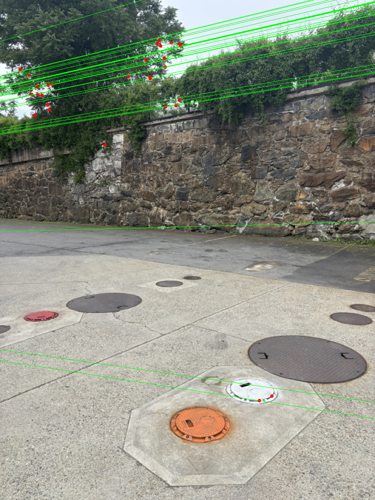
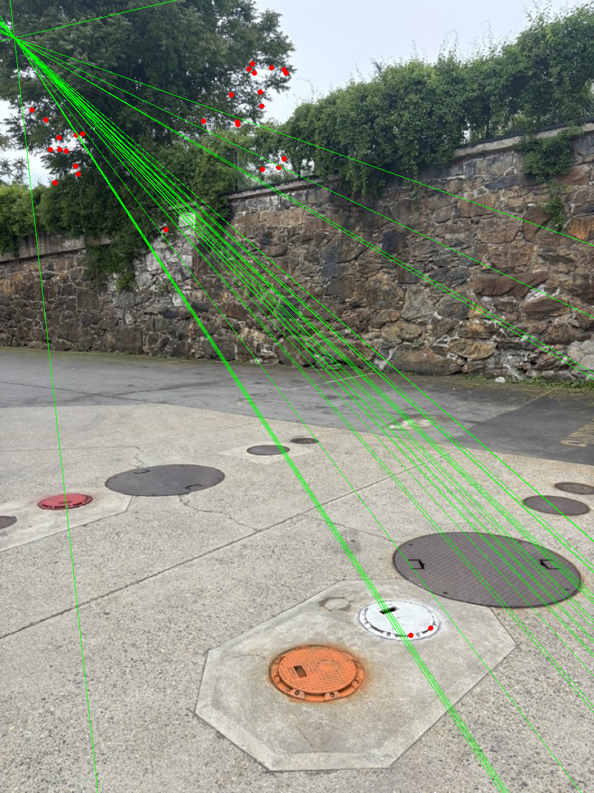
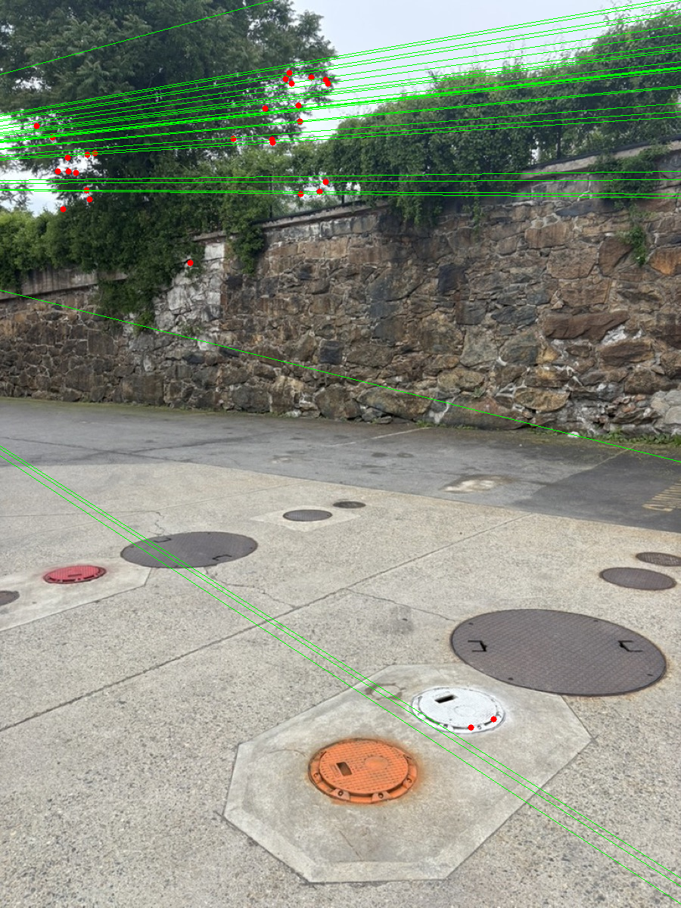

# Fundamental Matrix from Scratch

A hand-rolled implementation of the **normalized 8-point algorithm** for estimating
the fundamental matrix between two images, written in C++ with OpenCV. Built to learn
classical computer vision and C++ from the ground up — the linear algebra (building the
constraint matrix, the two SVDs, rank-2 enforcement) is implemented by hand rather than
calling `cv::findFundamentalMat`. Extends to the essential matrix and camera pose recovery.

## What it does

Given two photos of the same scene from different viewpoints, it:

1. Detects and matches features (ORB + brute-force Hamming matching)
2. Computes the fundamental matrix `F` via the normalized 8-point algorithm
3. Verifies the result against OpenCV and by epipolar constraint error
4. Filters RANSAC inliers using **Sampson distance** — a first-order geometric
   error that weights each correspondence by how far its matched point lies from
   the predicted epipolar line, without requiring full triangulation:
   `d_S = (x'ᵀFx)² / ((Fx)₀² + (Fx)₁² + (Fᵀx')₀² + (Fᵀx')₁²)`
5. Draws the epipolar lines to confirm the geometry visually
6. Lifts `F` to the **essential matrix** `E = KᵀFK` using calibrated intrinsics
7. Recovers camera **rotation R** and **translation t** via `cv::recoverPose`, resolving
   the 4-way sign ambiguity with a cheirality check

`F` encodes the epipolar geometry between the two views: for corresponding points
`x` and `x'`, it satisfies `x'ᵀ F x = 0`. `E` is the calibrated version — same
constraint but in normalized camera coordinates rather than pixels.

## Build

Requires OpenCV and CMake.

```bash
mkdir build && cd build
cmake ..
make
cd ..
```

## Run

Run from the project root so the `data/` image paths resolve:

```bash
./build/00_load        # load + display the image pair
./build/01_match       # detect + match features, draw matches
./build/02_opencv_f    # reference F via cv::findFundamentalMat + epipolar lines
./build/03_my_f        # hand-rolled 8-point F with RANSAC + Sampson distance
./build/04_calibrate   # calibrate camera intrinsics from checkerboard images
./build/05_essential   # essential matrix + recover R and t between cameras
```

## Project layout

```
apps/          one small program per build step (00–05)
  00_load        load + display image pair
  01_match       detect + match features
  02_opencv_f    reference F via cv::findFundamentalMat
  03_my_f        hand-rolled 8-point F with RANSAC
  04_calibrate   camera calibration from a checkerboard image set
  05_essential   essential matrix + recover R and t between cameras
include/
  epipolar_viz.hpp   helpers for drawing epipolar lines
  fundemental.hpp    hand-rolled 8-point algorithm, RANSAC, Sampson error
  matching.hpp       ORB feature detection and brute-force matching
data/
  left.jpg / right.jpg         stereo pair 1
  left_1.jpg / right_1.jpg     stereo pair 2
  calibration_imgs/            checkerboard images used for intrinsic calibration
output/
  camera_calibation.yml        camera intrinsics + distortion coefficients
  fundamental.yml              RANSAC fundamental matrix F
  essential.yml                essential matrix E, rotation R, translation t
CMakeLists.txt
```

## The algorithm (8-point, in order)

1. **Normalize** points (center at origin, scale mean distance to √2) — critical for
   numerical stability
2. **Build** the n×9 constraint matrix `A`, one row per correspondence
3. **SVD #1** — solve `Af = 0`; the solution is the singular vector with the smallest
   singular value, reshaped to 3×3
4. **SVD #2** — zero the smallest singular value to enforce rank 2 (makes all epipolar
   lines meet at a single epipole)
5. **Denormalize** — undo the normalization so `F` works in pixel coordinates

## Results

### Image pair 1 (left.jpg / right.jpg)

**OpenCV reference (`cv::findFundamentalMat` + RANSAC internally)**


**Hand-rolled 8-point algorithm (all matches, no RANSAC)**


**Hand-rolled 8-point algorithm with RANSAC + Sampson distance**


---

### Image pair 2 (left_1.jpg / right_1.jpg)

**OpenCV reference**


**Hand-rolled 8-point algorithm (all matches, no RANSAC)**


**Hand-rolled 8-point algorithm with RANSAC + Sampson distance**


# Camera Motion and Written Results
As seen above an indoor room (lots of repetitive
texture — serape stripes, blind slats, curtain grid) and an outdoor stone wall
(rich non-repetitive texture). In both the camera was roughly translated sideway with no rotation, so the epipolar lines should be near-horizontal. Three fundamental matrices are compared, each visualized by drawing epipolar
lines (green) and the corresponding points (red) on the right image. A correct F
is indicated by red points lying on their green lines. 

generally the raw algebraic 8-point fit can satisfy the epipolar constraint numerically
while still encoding an incorrect rotation. Switching the inlier metric to the Sampson distance, combined with RANSAC outlier rejection, brings the from-scratch
estimate into a closer agreement with OpenCV and with the true camera motion.


## Camera Calibration Results

Intrinsics estimated from a set of checkerboard images using `04_calibrate`
(`cv::calibrateCamera` with a 9×6 board). Results saved to `camera_calibation.yml`.

**RMS reprojection error: 0.2533 px**

**Camera matrix K:**

```
[1541.344  0.000     746.985]
[0.000     1537.615  988.655]
[0.000     0.000     1.000  ]
```

| Parameter | Value |
|-----------|-------|
| fx | 1541.344 px |
| fy | 1537.615 px |
| cx | 746.985 px |
| cy | 988.655 px |

**Distortion coefficients (k1, k2, p1, p2, k3):**

| k1 | k2 | p1 | p2 | k3 |
|----|----|----|----|----|
| 0.2913 | −1.9516 | −0.000771 | −0.000768 | 3.9679 |

The large k3 and opposing k1/k2 signs are typical for a wide-angle lens correcting
strong barrel distortion at mid-radii. The sub-pixel RMS error confirms the board
detections are consistent across the calibration set.

## Essential Matrix + Camera Pose Results

Using the calibrated intrinsics K, the fundamental matrix F is lifted to the essential matrix via `E = KᵀFK`. `cv::recoverPose` decomposes E and selects the geometrically valid (R, t) from the 4 candidates using a cheirality check — the solution where reconstructed points land in front of both cameras.

**Essential matrix E:**
```
[ 1.497  -9.033  -12.005]
[13.718  -0.506  -24.908]
[14.261  25.101    0.615]
```

**Rotation R** (small rotation between the two views):
```
[ 0.986  -0.061   0.154]
[ 0.065   0.998  -0.015]
[-0.153   0.025   0.988]
```

**Translation t** (unit direction vector — scale not recoverable from images alone):
```
[-0.862,  0.408,  -0.302]
```

The rotation is close to identity, consistent with a mostly sideways camera translation with minimal tilt. Scale would require a depth sensor, known object size, or IMU data.

## Notes / next steps

- **Triangulation** — given P1 = K[I|0] and P2 = K[R|t], use DLT on each RANSAC inlier pair to recover a sparse 3D point cloud
- **Dense depth** — if images are a rectified stereo pair, `cv::StereoSGBM` can produce a full disparity map
